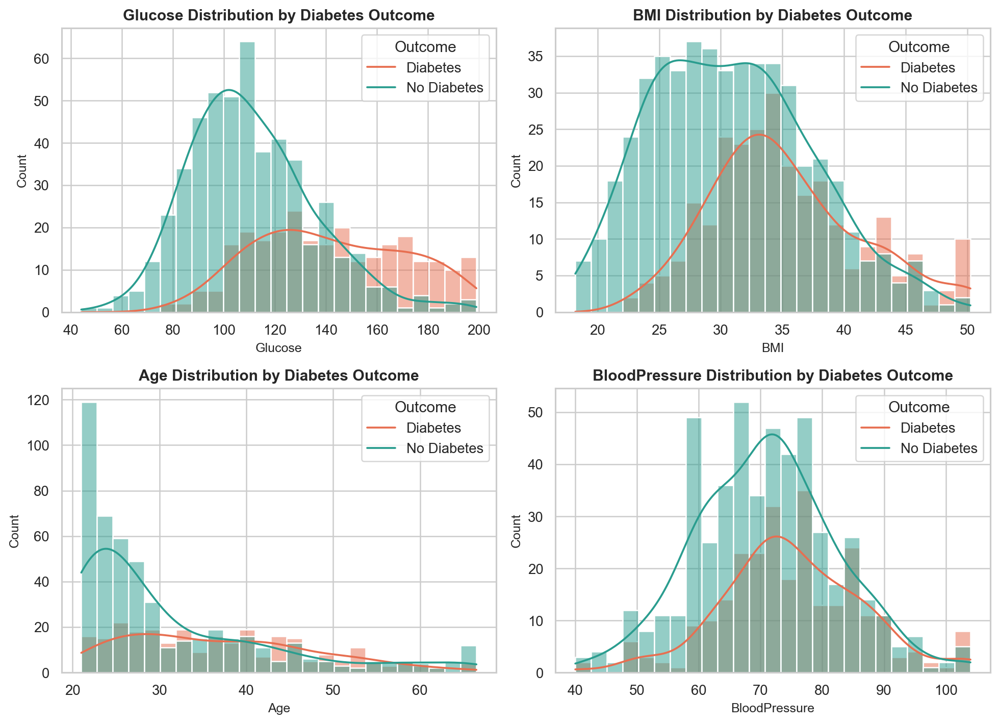
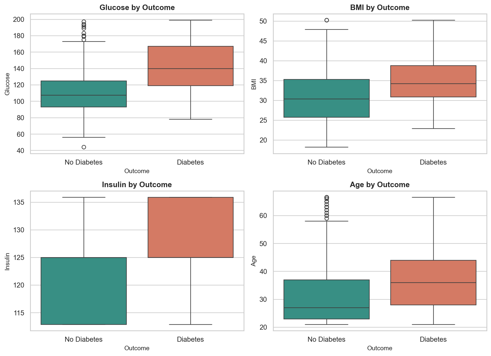
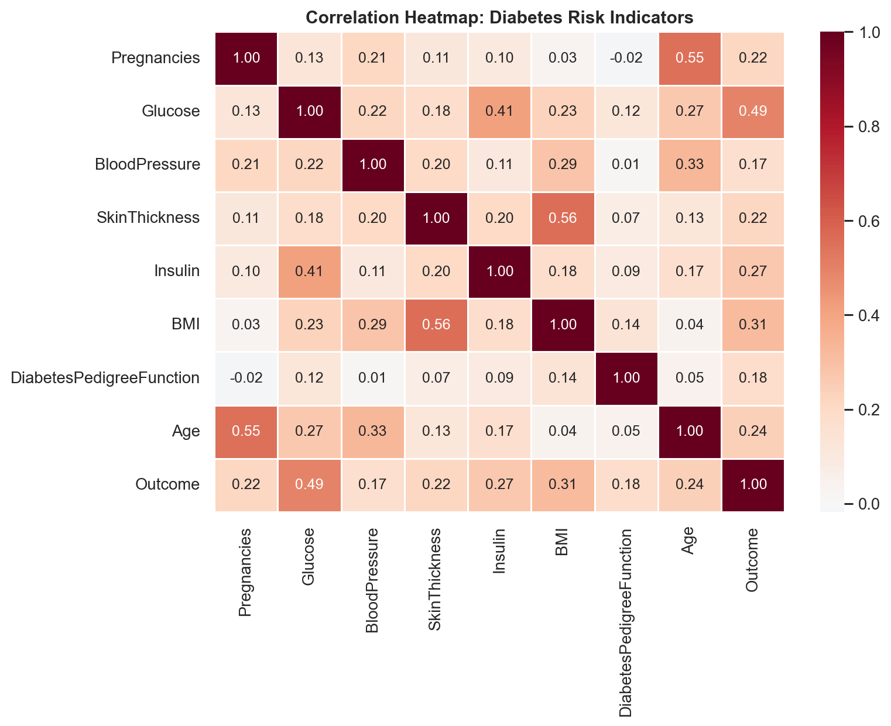
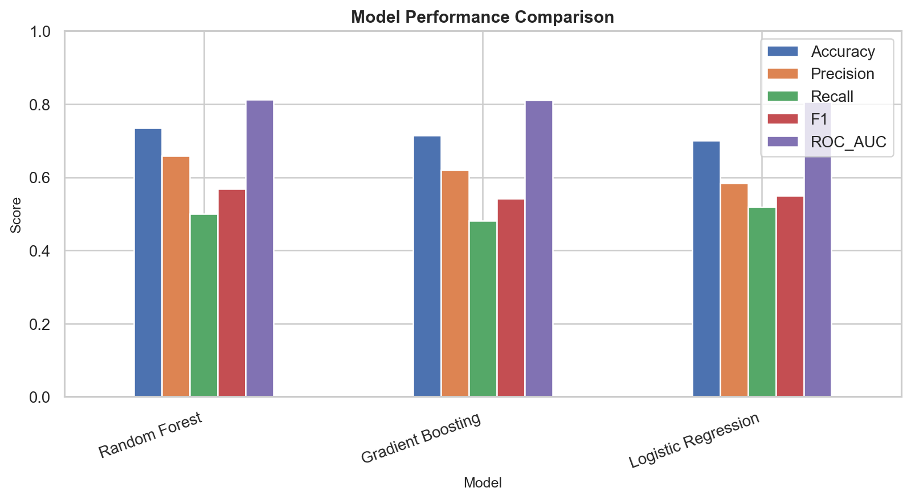
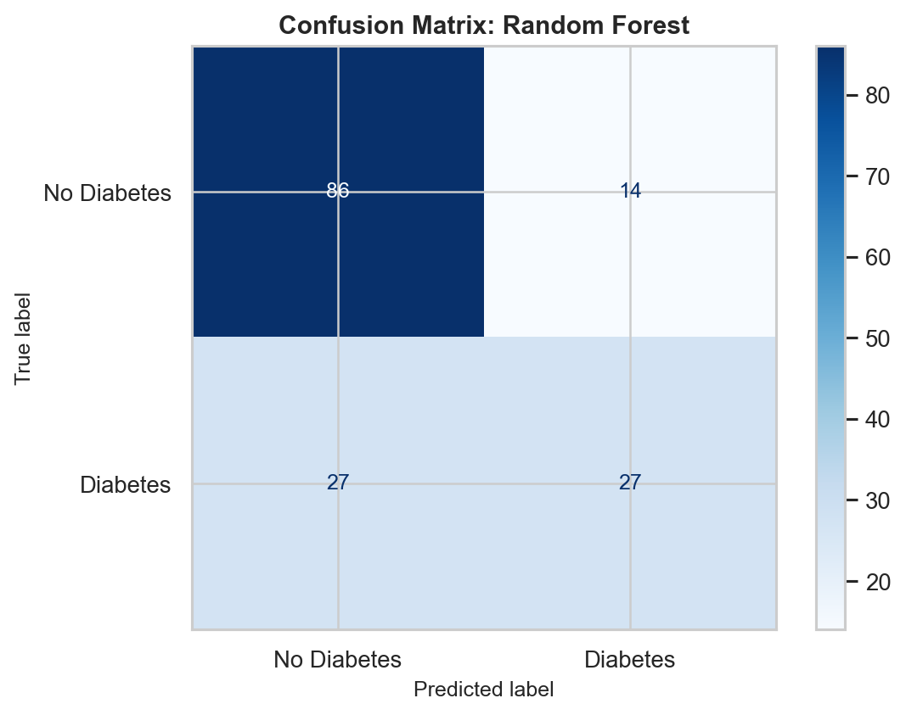
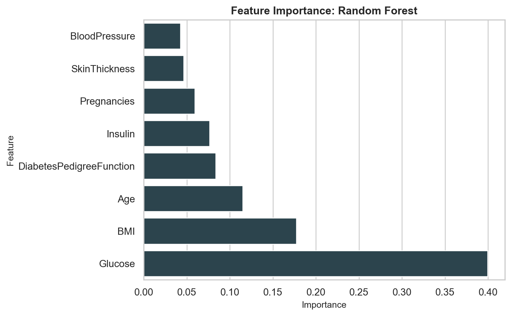

# Diabetes Risk Analysis and Prediction

## Overview

This project analyzes a real public diabetes dataset and builds Machine Learning models to predict diabetes risk from patient health indicators. The goal is to identify the strongest risk factors, compare model performance, and present the results in a clear format that supports healthcare screening and decision-making.

## Dataset

The analysis uses the **Pima Indians Diabetes Database**, a public medical dataset with 768 records.

The dataset includes:

- Pregnancies
- Glucose
- Blood pressure
- Skin thickness
- Insulin
- BMI
- Diabetes pedigree function
- Age
- Diabetes outcome

Dataset source details are documented in [DATASET_SOURCE.md](DATASET_SOURCE.md).

## Business Questions

This project answers practical healthcare analytics questions:

- Which health indicators are most associated with diabetes?
- How different are glucose, BMI, and age patterns between diabetic and non-diabetic patients?
- Which Machine Learning model performs best for diabetes risk prediction?
- Which features should be highlighted in a health monitoring dashboard?

## Work Completed

1. Loaded and validated the public diabetes dataset.
2. Checked missing values, duplicate records, invalid medical zeros, and target distribution.
3. Treated invalid zero values in medical fields as missing data and applied median imputation.
4. Created interpretable features such as BMI category, age group, and glucose risk group.
5. Built exploratory charts for distributions, outcome comparisons, correlations, and risk groups.
6. Trained and compared multiple Machine Learning models.
7. Selected Random Forest as the best-performing model based on ROC-AUC.
8. Generated model performance tables, feature importance, charts, and a final analysis report.

## Key Findings

- Glucose is the strongest predictor of diabetes risk.
- BMI and age also show meaningful association with diabetes outcome.
- Patients with higher glucose and higher BMI show visibly higher diabetes rates.
- Random Forest achieved the strongest overall model performance among the tested models.

## Model Summary

Best model: **Random Forest**

Model outputs are available in:

- [model_performance.csv](reports/model_performance.csv)
- [feature_importance.csv](reports/feature_importance.csv)
- [Diabetes_Risk_Analysis_Report.md](reports/Diabetes_Risk_Analysis_Report.md)

## Visual Results

### Feature Distributions



### Outcome Boxplots



### Correlation Heatmap



### Model Performance



### Confusion Matrix



### Feature Importance



## Project Files

```text
assets/charts/                         # Generated visualizations
data/                                  # Dataset files
notebooks/Diabetes_Risk_Analysis.ipynb # Analysis notebook
reports/                               # Report, metrics, and model outputs
src/build_diabetes_analysis.py         # Reproducible analysis pipeline
DATASET_SOURCE.md                      # Dataset documentation
```

## How to Run

Run the full analysis pipeline:

```bash
python src/build_diabetes_analysis.py
```

The script regenerates the analysis outputs, charts, model metrics, report, and notebook.

## Tools Used

- Python
- Pandas
- NumPy
- Matplotlib
- Seaborn
- Scikit-learn
- Random Forest Classification

## Deliverables

- Cleaned and prepared medical dataset
- Exploratory data analysis charts
- Model comparison and evaluation metrics
- Feature importance analysis
- Final diabetes risk analysis report
- Reproducible Python pipeline
